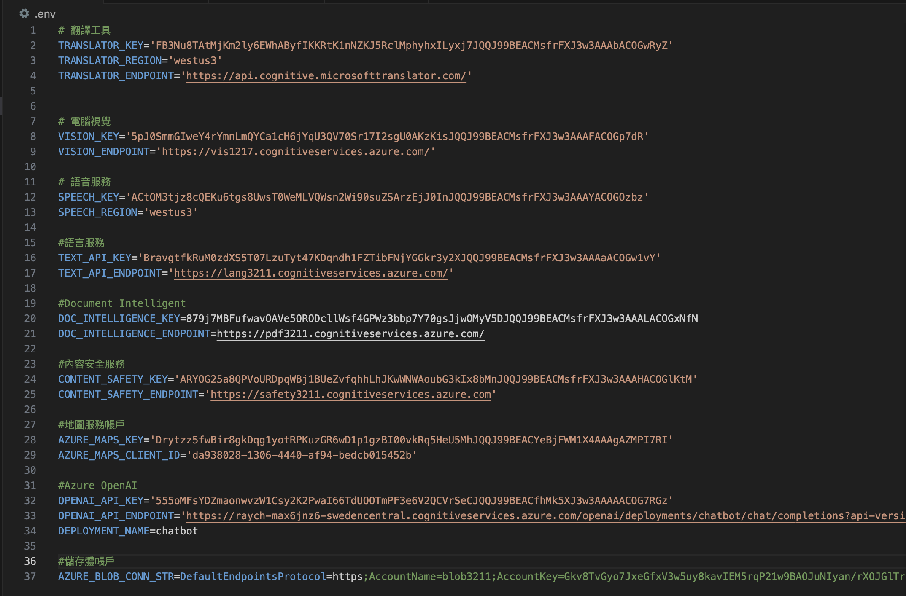
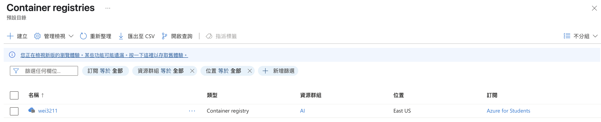
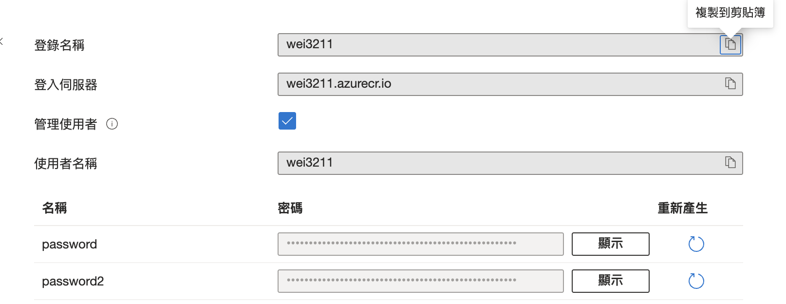
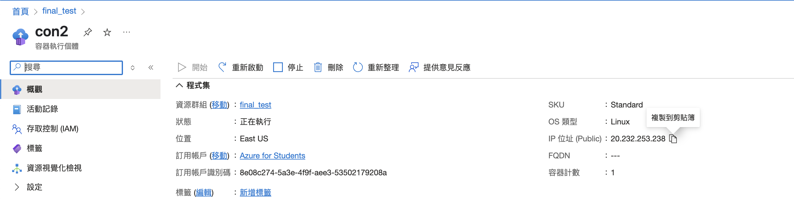
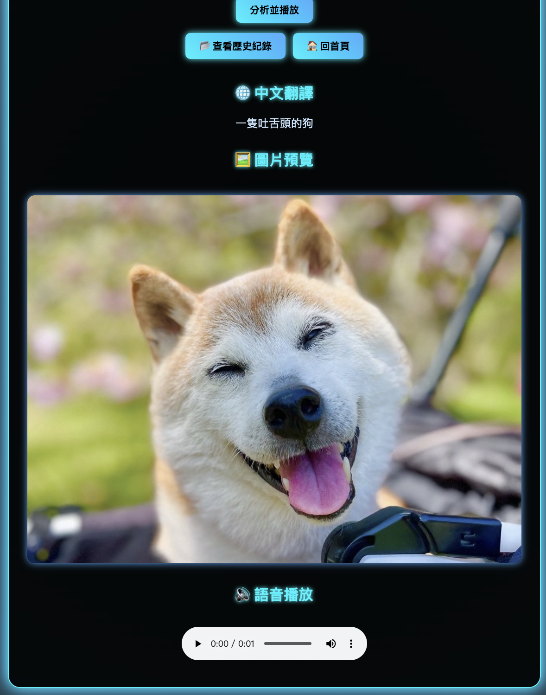
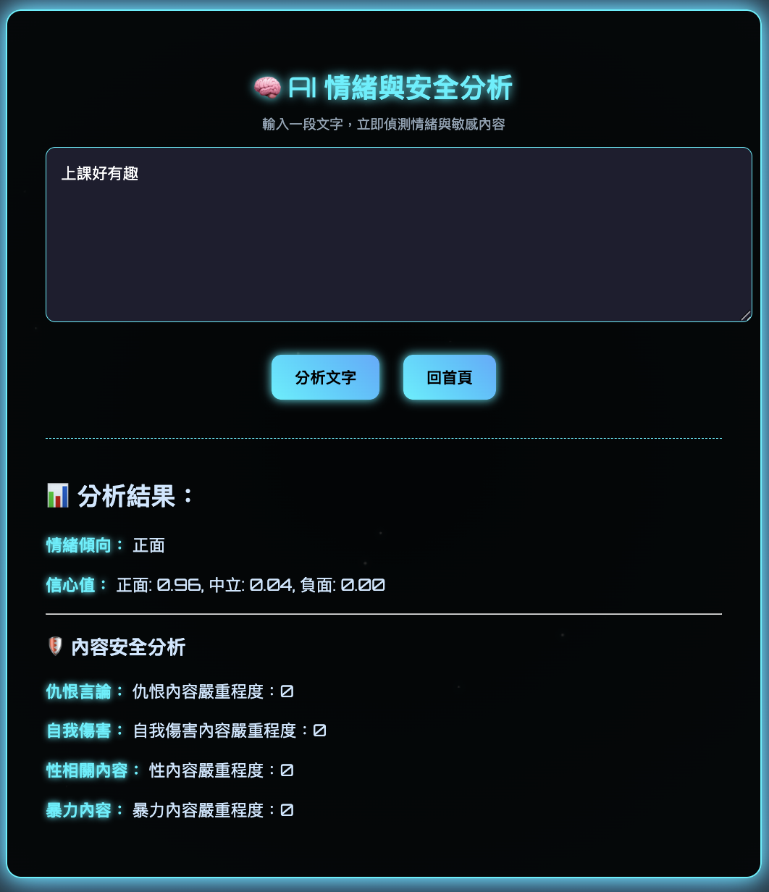
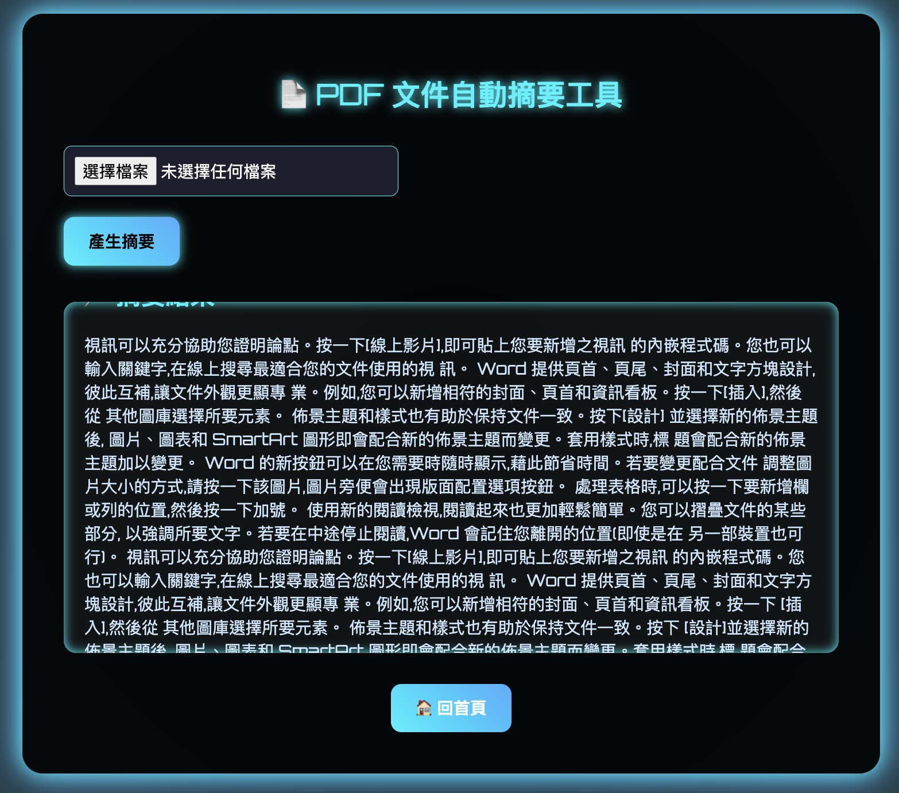
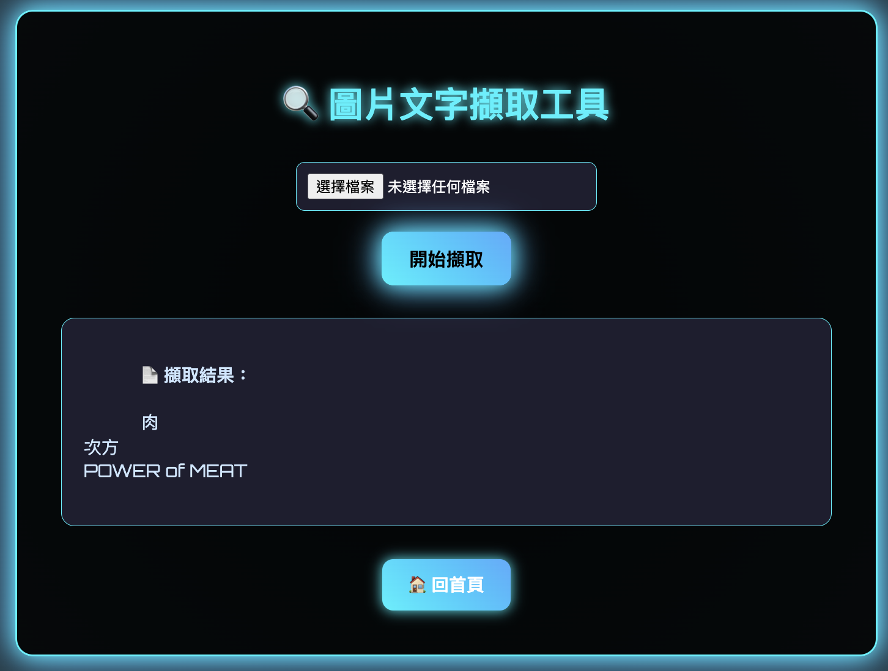
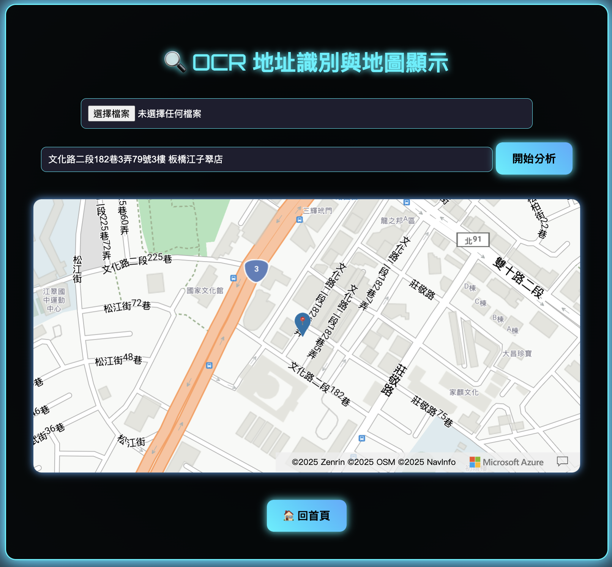
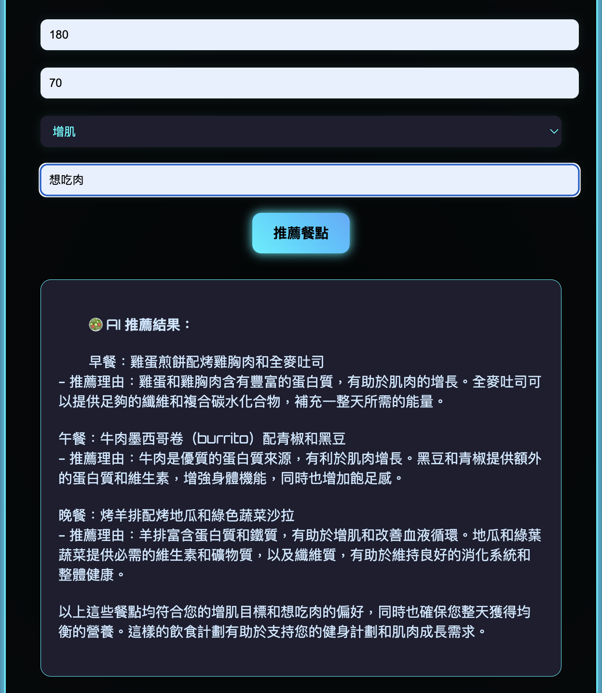

# Azure AI 智慧工具平台

整合多項 Azure AI 服務的多功能網頁應用程式，使用者可透過瀏覽器直接進行圖片辨識、文字擷取、情感分析、PDF 摘要、地圖定位與 AI 飲食推薦，特別適合視障者、外語使用者或希望提升資訊可及性的應用場景。

---

# 📚 目錄
- [專案功能介紹](#專案功能介紹)
- [使用技術](#使用技術)
- [本機執行](#本機執行)
- [部署說明](#部署說明)
- [程式碼說明](#程式碼說明)
- [成果展示](#成果展示)

---

## 專案功能介紹

### 📷 圖片語音翻譯

上傳圖片網址後，系統會自動辨識圖中內容（含描述與物件），並翻譯成中文，最後透過語音播放結果，協助視障者或外語使用者理解圖片資訊。

### 💬 文字情緒分析

輸入任意段落文字，系統會同步執行兩項分析：

- **情緒分析**（Text Analytics）：判斷文字為正向、中性或負向  
- **內容安全檢測**（Content Safety）：偵測是否包含仇恨語言、自我傷害、暴力或性暗示等不當內容

此功能可應用於社群留言審查、客服訊息分類、學生作業輔助等，確保回饋分析更具安全性與準確性。

### 📄 PDF 摘要工具

上傳 PDF 文件（如研究報告、簡報、說明書），系統可自動產生重點摘要，節省閱讀時間並快速掌握重點內容。

### 🔍 圖片文字擷取（OCR）

上傳圖片後，自動擷取圖片中的文字內容（如照片、簡章、截圖等）。

### 📍 OCR 地址地圖工具

結合 OCR 與 Azure Maps，系統可從圖片中辨識出地址文字並顯示在地圖上，實現從「圖片 → 位置」的智慧定位應用。

### 🥗 健康餐點推薦 AI

輸入個人條件（如身高、體重、飲食偏好），系統即會透過 AI 模型推薦當日三餐建議，並說明搭配理由，適合個人化健康飲食規劃。

---

## 使用技術


**部署**：Azure Container Registry + Azure Container Instance

**整合的 Azure AI 服務**

- **Computer Vision** — 圖片內容辨識、OCR 文字擷取
- **Translator** — 英文描述翻譯為繁體中文
- **Speech Service** — 文字轉語音（TTS）合成 MP3
- **Blob Storage** — 儲存圖片、語音檔與 metadata
- **Text Analytics** — 情感分析
- **Content Safety** — 有害內容偵測
- **Document Intelligence** — PDF 文字擷取
- **Maps** — 地址轉座標、地圖顯示
- **OpenAI** — GPT 模型飲食推薦生成

---

## 本機執行

### 1. 安裝套件

```bash
pip install -r requirements.txt
```

### 2. 設定環境變數

```bash
cp .env.example .env
```

編輯 `.env`，填入各項 Azure 服務的金鑰與端點。

### 3. 啟動伺服器

```bash
python web.py
```

開啟瀏覽器前往 `http://localhost:8080`

---

## 部署說明

本文件詳述整個部署流程：從 Azure 各項服務建置、Docker 容器化、上傳至 Azure Container Registry（ACR），再到 Container Instance 的部署與測試。

---

### 📁 1. 建立資源群組

建立資源群組 `[群組名稱]`，用於集中管理所有 Azure AI 相關服務。

---

### 🤖 2. 建立 AI 服務（請選擇 Free F0 層）

- 🎯 電腦視覺（Computer Vision）  
- 🌐 翻譯工具（Azure Translator）  
- 🔊 語音服務（Speech Service）  
- 🗂️ 儲存體帳戶（Azure Blob Storage）  
- 🙂 語言服務（Text Analytics – 情感分析）  
- 🚫 內容安全服務（Content Safety） 
- 📄 Document Intelligence  
- 🗺️ 地圖服務帳戶（Azure Maps）
- 💬 Azure OpenAI

---

### 🔑 3. 取得端點與金鑰

前往每個服務的 **金鑰與端點** 頁面，複製內容供程式使用。

📷 *範例圖：*



---

### 🐳 4. 建構 Docker 映像檔

在專案根目錄執行以下指令：

```bash
docker image build -t final:latest .
```

---

### 🖥️ 5. 執行本地容器

```bash
docker container run -d --env-file .env --name final -p 8080:8080 final:latest
```

可透過 `http://localhost:8080` 驗證是否執行成功。

---

### 📁 6. 建立容器部署用資源群組

創建一個資源群組 `[群組名稱]`，用來存放容器相關的最終成果。

---

### 🏗️ 7. 創建 Azure Container Registry

於 Azure Portal 中創建 ACR（建議使用標準命名格式）

📷 *範例圖：*



---

### 🔐 8. 啟用 Azure Container Registry 的管理使用者，取得金鑰

📷 *範例圖：*



---

### 🔑 9. 登入 Azure Container Registry

```bash
docker login wei3211.azurecr.io
```

輸入以下帳密：

- Username: `wei3211`
- Password: `[password or password2]`

成功會顯示：

```bash
Login Succeeded
```

---

### 🛠️ 10. 建立自定義的映像檔

```bash
docker image build -t wei3211.azurecr.io/finaltest:latest .
```

---

### ☁️ 11. 將 Docker 映像檔上傳到 Azure Container Registry

```bash
docker image push wei3211.azurecr.io/finaltest:latest
```

---

### 🚀 12. 建立容器執行個體並使用 IP 存取

在 Azure Portal 建立容器執行個體（Container Instance），**指定公開連接埠為 8080**，並透過環境變數設定所有金鑰。

執行後請使用以下格式存取：

```
http://[公用 IP 位址]:8080
```

📷 *範例圖：*



---

### ✅ 結語

你已成功將 Azure AI 智慧工具平台部署至 Azure，恭喜恭喜🎊

---

## 程式碼說明

### 📷 圖片語音翻譯

使用者上傳一張圖片網址後，系統會執行下列流程：

1. 使用 Azure **Computer Vision** 擷取圖片的敘述與標籤
2. 使用 **Translator** 將敘述與標籤翻譯為中文（繁體）
3. 使用 **Text-to-Speech** 將翻譯後文字轉為 mp3 語音
4. 將語音與圖片分別上傳至 **Azure Blob Storage**
5. 將 metadata（圖片、語音網址與標籤）儲存為 JSON
6. 將分析結果回傳前端顯示

此功能整合了三項 Azure 服務，實現從圖片 → 翻譯 → 語音 → 雲端儲存的完整流程。

```python
@app.route("/image_tool", methods=["GET", "POST"])
def index():
    image_url = ""
    description = ""
    tags = []
    tags_zh = []
    translation = ""
    blob_image_url = ""
    blob_audio_url = ""

    if request.method == "POST":
        image_url = request.form.get("image_url")
        pair_id = uuid.uuid4().hex  # 為本次分析生成唯一 ID

        # 🔍 圖像辨識（Computer Vision）
        vision_url = VISION_ENDPOINT.rstrip("/") + "/vision/v3.2/analyze"
        headers = {"Ocp-Apim-Subscription-Key": VISION_KEY, "Content-Type": "application/json"}
        params = {"visualFeatures": "Description,Tags"}
        body = {"url": image_url}
        vision_resp = requests.post(vision_url, headers=headers, params=params, json=body)
        vision_data = vision_resp.json()

        description = vision_data.get("description", {}).get("captions", [{}])[0].get("text", "")

        tag_objs = vision_data.get("tags", [])
        if tag_objs:
            top_tag = sorted(tag_objs, key=lambda x: x.get("confidence", 0), reverse=True)[0]
            tags = [top_tag["name"]]

        # 🌐 翻譯描述文字（英文 → 繁體中文）
        translator = TextTranslationClient(
            endpoint=TRANSLATOR_ENDPOINT,
            credential=TranslatorCredential(TRANSLATOR_KEY, TRANSLATOR_REGION)
        )
        translation_result = translator.translate(
            content=[InputTextItem(text=description)],
            from_parameter="en",
            to=["zh-Hant"]
        )
        translation = translation_result[0].translations[0].text

        if tags:
            tag_items = [InputTextItem(text=tag) for tag in tags]
            tag_result = translator.translate(content=tag_items, from_parameter="en", to=["zh-Hant"])
            tags_zh = [r.translations[0].text for r in tag_result]

        # 🔊 語音合成（TTS）
        speech_config = speechsdk.SpeechConfig(subscription=SPEECH_KEY, region=SPEECH_REGION)
        audio_filename = f"speech_{pair_id}.mp3"
        audio_path = os.path.join("static", audio_filename)
        audio_output = speechsdk.audio.AudioOutputConfig(filename=audio_path)
        synthesizer = speechsdk.SpeechSynthesizer(speech_config=speech_config, audio_config=audio_output)
        synthesizer.speak_text_async(translation).get()

        with open(audio_path, "rb") as audio_file:
            container_client.upload_blob(name=audio_filename, data=audio_file, overwrite=True)
        blob_audio_url = f"{container_client.url}/{audio_filename}"

        image_resp = requests.get(image_url)
        image_filename = f"image_{pair_id}.jpg"
        container_client.upload_blob(name=image_filename, data=image_resp.content, overwrite=True)
        blob_image_url = f"{container_client.url}/{image_filename}"

        metadata = {
            "id": pair_id,
            "image": blob_image_url,
            "audio": blob_audio_url,
            "tags": tags,
            "tags_zh": tags_zh
        }
        tagfile = f"meta_{pair_id}.json"
        container_client.upload_blob(name=tagfile, data=json.dumps(metadata), overwrite=True)

    return render_template("index.html",
                           image_url=blob_image_url,
                           description=description,
                           tags=tags,
                           tags_zh=tags_zh,
                           translation=translation,
                           audio_url=blob_audio_url)
```

### 💬 文字情緒分析

使用者輸入一段文字後，系統會同時執行以下兩項分析：

1. **情緒分析（Text Analytics）**  
   判斷該段文字是「正面」、「中立」或「負面」，並顯示三類情緒的信心分數（0.00～1.00）。

2. **內容安全分析（Content Safety）**  
   檢查文字是否含有：
   - 仇恨語言（Hate）
   - 自我傷害內容（Self-harm）
   - 性暗示或裸露（Sexual）
   - 暴力相關文字（Violence）

當任何一類的嚴重度超過警告門檻（≥ 2），系統會顯示提示警語。

```python
@app.route("/text_sentiment", methods=["GET", "POST"])
def text_sentiment():
    text_input = ""
    sentiment = ""
    confidence = ""
    warning_message = ""
    content_safety_results = {
        "hate": "",
        "self_harm": "",
        "sexual": "",
        "violence": ""
    }

    if request.method == "POST":
        text_input = request.form.get("user_text", "").strip()
        if not text_input:
            sentiment = "❌ 請輸入有效文字"
            return render_template("sentiment.html", text=text_input, sentiment=sentiment, confidence="")

        # ✅ 情緒分析（Text Analytics）
        credential = AzureKeyCredential(TEXT_API_KEY)
        text_client = TextAnalyticsClient(endpoint=TEXT_API_ENDPOINT, credential=credential)
        documents = [{"id": "1", "text": text_input}]
        response = text_client.analyze_sentiment(documents=documents)[0]

        sentiment_map = {"positive": "正面", "neutral": "中立", "negative": "負面"}
        sentiment = sentiment_map.get(response.sentiment, response.sentiment)
        confidence = (
            f"正面: {response.confidence_scores.positive:.2f}, "
            f"中立: {response.confidence_scores.neutral:.2f}, "
            f"負面: {response.confidence_scores.negative:.2f}"
        )

        # ✅ 安全性檢查（Content Safety）
        try:
            safety_client = ContentSafetyClient(CONTENT_SAFETY_ENDPOINT, AzureKeyCredential(CONTENT_SAFETY_KEY))
            safety_result = safety_client.analyze_text(AnalyzeTextOptions(text=text_input))
            SEVERITY_THRESHOLD = 2

            for item in safety_result.categories_analysis:
                if item.category == TextCategory.HATE:
                    content_safety_results["hate"] = f"仇恨內容嚴重程度：{item.severity}"
                    if item.severity >= SEVERITY_THRESHOLD:
                        warning_message = "⚠️ 文字中含有仇恨語言，請嘗試輸入其他內容。"
                elif item.category == TextCategory.SELF_HARM:
                    content_safety_results["self_harm"] = f"自我傷害內容嚴重程度：{item.severity}"
                    if item.severity >= SEVERITY_THRESHOLD:
                        warning_message = "⚠️ 文字中出現自我傷害傾向，請重新輸入健康內容。"
                elif item.category == TextCategory.SEXUAL:
                    content_safety_results["sexual"] = f"性內容嚴重程度：{item.severity}"
                    if item.severity >= SEVERITY_THRESHOLD:
                        warning_message = "⚠️ 文字中包含敏感性內容，請嘗試輸入其他內容。"
                elif item.category == TextCategory.VIOLENCE:
                    content_safety_results["violence"] = f"暴力內容嚴重程度：{item.severity}"
                    if item.severity >= SEVERITY_THRESHOLD:
                        warning_message = "⚠️ 文字中包含暴力相關字眼，請嘗試輸入其他內容。"
        except Exception as e:
            content_safety_results["error"] = f"⚠️ 安全性分析失敗: {e}"

    return render_template(
        "sentiment.html",
        text=text_input,
        sentiment=sentiment,
        confidence=confidence,
        content_safety=content_safety_results,
        warning=warning_message
    )
```

### 📄 PDF 摘要工具

此功能允許使用者上傳 PDF 文件，系統會：

1. 使用 Azure **Document Intelligence** 預建模型 `prebuilt-read` 對 PDF 進行逐頁掃描
2. 擷取每頁中的所有文字行（line.content）
3. 將所有擷取文字串接成一段長內容
4. 顯示前 1000 字作為文件摘要，協助快速掌握重點

```python
@app.route("/pdf_summary", methods=["GET", "POST"])
def pdf_summary():
    summary = ""
    filename = ""

    if request.method == "POST":
        if "pdf_file" not in request.files:
            return render_template("pdf_summary.html", summary="沒有上傳檔案")

        file = request.files["pdf_file"]
        if file.filename == "":
            return render_template("pdf_summary.html", summary="請選擇檔案")

        if file:
            filename = secure_filename(file.filename)
            file_path = os.path.join(app.config['UPLOAD_FOLDER'], filename)
            file.save(file_path)

            with open(file_path, "rb") as f:
                poller = doc_client.begin_analyze_document(
                    model_id="prebuilt-read",
                    document=f,
                )
                result = poller.result()

                if result.pages:
                    text = "\n".join([line.content for page in result.pages for line in page.lines])
                else:
                    text = "⚠️ 無法擷取內容"

                summary = text[:1000] + "..." if len(text) > 1000 else text

    return render_template("pdf_summary.html", summary=summary, filename=filename)
```

### 🔍 圖片文字擷取（OCR）

使用者上傳任一張圖片後，系統會執行以下流程：

1. 使用 **Azure Computer Vision** 的 `imageanalysis:analyze` 介面（搭配新版 `api-version=2023-10-01`）  
2. 啟用 `features=read`，對圖片進行 OCR 辨識  
3. 將擷取到的所有文字行整合為結果，顯示於前端頁面

```python
@app.route("/ocr_tool", methods=["GET", "POST"])
def ocr_tool():
    extracted_text = ""
    filename = ""

    if request.method == "POST":
        if "image_file" not in request.files:
            return render_template("ocr_tool.html", text="沒有上傳檔案", filename="")

        file = request.files["image_file"]
        if file.filename == "":
            return render_template("ocr_tool.html", text="請選擇檔案", filename="")

        if file:
            filename = secure_filename(file.filename)
            file_path = os.path.join(app.config['UPLOAD_FOLDER'], filename)
            file.save(file_path)

            with open(file_path, "rb") as f:
                image_data = f.read()

            try:
                headers = {
                    "Ocp-Apim-Subscription-Key": VISION_KEY,
                    "Content-Type": "application/octet-stream"
                }
                params = {"api-version": "2023-10-01"}
                ocr_url = f"{VISION_ENDPOINT}/computervision/imageanalysis:analyze?features=read"
                response = requests.post(ocr_url, headers=headers, params=params, data=image_data)
                result = response.json()

                lines = []
                blocks = result.get("readResult", {}).get("blocks", [])
                for block in blocks:
                    for line in block.get("lines", []):
                        text = line.get("text", "")
                        if text:
                            lines.append(text)

                extracted_text = "\n".join(lines) if lines else "⚠️ 沒有偵測到文字"

            except Exception as e:
                extracted_text = f"⚠️ 文字擷取失敗：{str(e)}"

    return render_template("ocr_tool.html", text=extracted_text, filename=filename)
```

### 📍 OCR 地址地圖工具

使用者上傳圖片後，系統會進行以下操作：

1. 使用 Azure **Computer Vision OCR** 模型從圖片中擷取出所有文字  
2. 使用者可選擇輸入或點選其中一段為「地址文字」  
3. 呼叫 **Azure Maps** Search API 查詢該地址座標位置  
4. 若查詢成功，地圖會自動定位並標示該地點

```python
@app.route("/ocr_map_tool", methods=["GET", "POST"])
def ocr_map_tool():
    extracted_text = ""
    filename = ""
    map_coords = None
    query_address = ""

    if request.method == "POST":
        if "image_file" in request.files:
            file = request.files["image_file"]
            if file.filename != "":
                filename = secure_filename(file.filename)
                file_path = os.path.join(app.config['UPLOAD_FOLDER'], filename)
                file.save(file_path)

                with open(file_path, "rb") as f:
                    image_data = f.read()

                try:
                    headers = {
                        "Ocp-Apim-Subscription-Key": VISION_KEY,
                        "Content-Type": "application/octet-stream"
                    }
                    params = {"api-version": "2023-10-01"}
                    ocr_url = f"{VISION_ENDPOINT}/computervision/imageanalysis:analyze?features=read"
                    response = requests.post(ocr_url, headers=headers, params=params, data=image_data)
                    result = response.json()

                    lines = []
                    read_result = result.get("readResult")
                    if read_result and "blocks" in read_result:
                        blocks = read_result["blocks"]
                        for block in blocks:
                            for line in block.get("lines", []):
                                lines.append(line.get("text", ""))
                        extracted_text = "\n".join(lines) if lines else "⚠️ 沒有偵測到文字"
                    else:
                        extracted_text = f"⚠️ 無法擷取文字：{result.get('error', {}).get('message', '未知錯誤')}"

                except Exception as e:
                    extracted_text = f"⚠️ 文字擷取失敗：{str(e)}"

        if request.form.get("map_search"):
            query_address = request.form.get("address", "")
            if query_address:
                try:
                    maps_url = "https://atlas.microsoft.com/search/address/json"
                    maps_params = {
                        "api-version": "1.0",
                        "subscription-key": AZURE_MAPS_KEY,
                        "query": query_address
                    }
                    maps_resp = requests.get(maps_url, params=maps_params)
                    maps_data = maps_resp.json()

                    position = maps_data.get("results", [{}])[0].get("position", {})
                    if position:
                        map_coords = {
                            "lat": position.get("lat"),
                            "lon": position.get("lon")
                        }

                except Exception as e:
                    extracted_text += f"\n⚠️ 查詢地圖錯誤：{e}"

    return render_template(
        "ocr_map_tool.html",
        text=extracted_text,
        filename=filename,
        map_coords=map_coords,
        query_address=query_address,
        azure_maps_key=AZURE_MAPS_KEY
    )
```

### 🥗 健康餐點推薦 AI

使用者輸入身高、體重、飲食目標（如減脂、增肌、均衡飲食）與個人偏好（如素食、清淡、日式料理等），系統會：

1. 將條件整理為 prompt，送入 Azure OpenAI GPT 模型
2. 回傳三餐建議內容與推薦理由
3. 顯示於畫面上，協助使用者每日飲食規劃與營養均衡管理

```python
@app.route("/recommand", methods=["GET", "POST"])
def diet_recommend():
    result = ""
    if request.method == "POST":
        height = request.form.get("height")
        weight = request.form.get("weight")
        goal = request.form.get("goal")
        preference = request.form.get("preference")

        prompt = f"""
        使用者身高 {height} 公分，體重 {weight} 公斤，
        飲食目標是「{goal}」，飲食偏好是「{preference}」。
        請用繁體中文推薦今天的三餐，列出每一餐的內容與推薦理由。
        """

        try:
            response = client.chat.completions.create(
                model=DEPLOYMENT_NAME,
                messages=[
                    {"role": "user", "content": prompt}
                ]
            )
            result = response.choices[0].message.content
        except Exception as e:
            result = f"❗ 發生錯誤：{e}"

    return render_template("recommand.html", result=result)
```

---

## 成果展示

<table align="center">
  <tr>
    <td align="center">
      <br/>
      <sub>圖片語音翻譯</sub>
    </td>
    <td align="center">
      <br/>
      <sub>文字情緒分析</sub>
    </td>
  </tr>
  <tr>
    <td align="center">
      <br/>
      <sub>PDF 摘要工具</sub>
    </td>
    <td align="center">
      <br/>
      <sub>圖片文字擷取（OCR）</sub>
    </td>
  </tr>
  <tr>
    <td align="center">
      <br/>
      <sub>OCR 地址地圖工具</sub>
    </td>
    <td align="center">
      <br/>
      <sub>健康餐點推薦 AI</sub>
    </td>
  </tr>
</table>

---

## Contributors

| 姓名 |
|------|
| 陳祥瑋 |
| 鄭博仁 |
| 陳紀宇 |
| 歐陽柏晨 |

---

## License

This project is licensed under the MIT License. See [LICENSE](LICENSE) for details.

